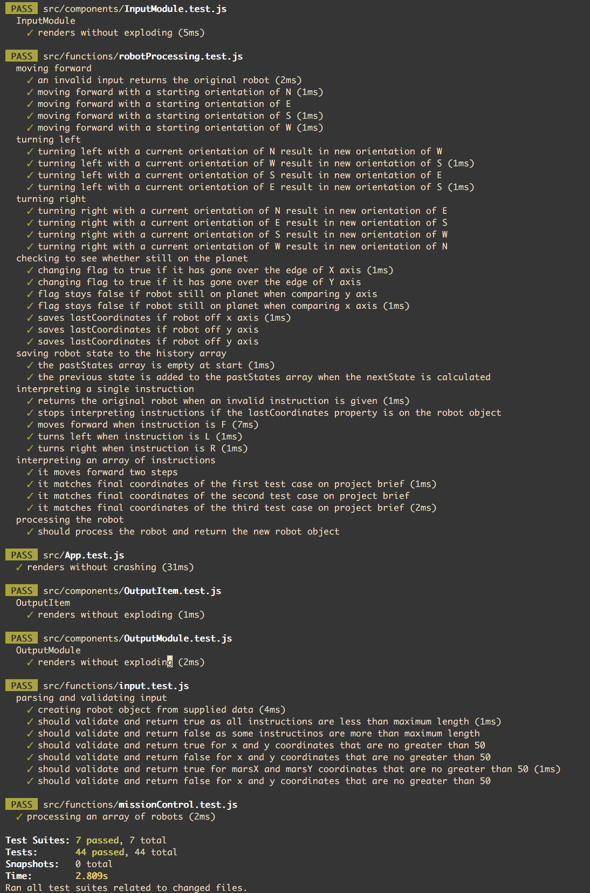

## Notes

I have used create-react-app to bootstrap this application, and then added the Airbnb ESLint configuration for linting.

I have added Facebooks Flow for static typing, because whilst I have fairly limited experience with it, this seems like a great opportunity to gain experience with it whilst improving the quality of my code.

I have decided to approach this in a way that is inspired by functional programming, and in particular concepts and techniques I have learnt from the use of Redux over the last few months, such as immutability and partial application.

To style this project, I have used 'styled-components', as I think it fits in well with the component based structure of a React App, and avoids the need for name spacing rules that can sometimes become an additional cognitive overhead.

To run this project locally please use the following commands...

   - 'yarn install' to install dependencies.

   - 'yarn start' to start the development server.

   - 'yarn test' to run the Jest unit tests.

The Server will be running on localhost port 3000

#### Unit Tests

#### TODO

I have yet to implement the function to add a robots last 'on planet' location to the lost robots array within the robot object.

I am also yet to add the interface for inputting data, and outputting the result.

 ## Problem: Martian Robots

The Problem
The surface of Mars can be modelled by a rectangular grid around which robots are able to move according to instructions provided from Earth. You are to write a program that determines each sequence of robot positions and reports the final position of the robot.
A robot position consists of a grid coordinate (a pair of integers: x-coordinate followed by y-coordinate) and an orientation (N, S, E, W for north, south, east, and west).

A robot instruction is a string of the letters “L”, “R”, and “F” which represent, respectively, the instructions:

● Left : the robot turns left 90 degrees and remains on the current grid point.

● Right : the robot turns right 90 degrees and remains on the current grid point.

● Forward : the robot moves forward one grid point in the direction of the current
orientation and maintains the same orientation.

The direction North corresponds to the direction from grid point (x, y) to grid point (x, y+1). There is also a possibility that additional command types may be required in the future and provision should be made for this.

Since the grid is rectangular and bounded (...yes Mars is a strange planet), a robot that moves “off” an edge of the grid is lost forever. However, lost robots leave a robot “scent” that prohibits future robots from dropping off the world at the same grid point. The scent is left at the last grid position the robot occupied before disappearing over the edge. An instruction to move “off” the world from a grid point from which a robot has been previously lost is simply ignored by the current robot.

#### The Input

The first line of input is the upper-right coordinates of the rectangular world, the lower-left coordinates are assumed to be 0, 0.
The remaining input consists of a sequence of robot positions and instructions (two lines per robot). A position consists of two integers specifying the initial coordinates of the robot and an orientation (N, S, E, W), all separated by whitespace on one line. A robot instruction is a string of the letters “L”, “R”, and “F” on one line.

Each robot is processed sequentially, i.e., finishes executing the robot instructions before the next robot begins execution.

The maximum value for any coordinate is 50.

All instruction strings will be less than 100 characters in length.

#### The Output

For each robot position/instruction in the input, the output should indicate the final grid position and orientation of the robot. If a robot falls off the edge of the grid the word “LOST” should be printed after the position and orientation.

#### Sample Input

53

11E

RFRFRFRF

32N

FRRFLLFFRRFLL

03W

LLFFFLFLFL

#### Sample Output

11E

33N LOST

23S
